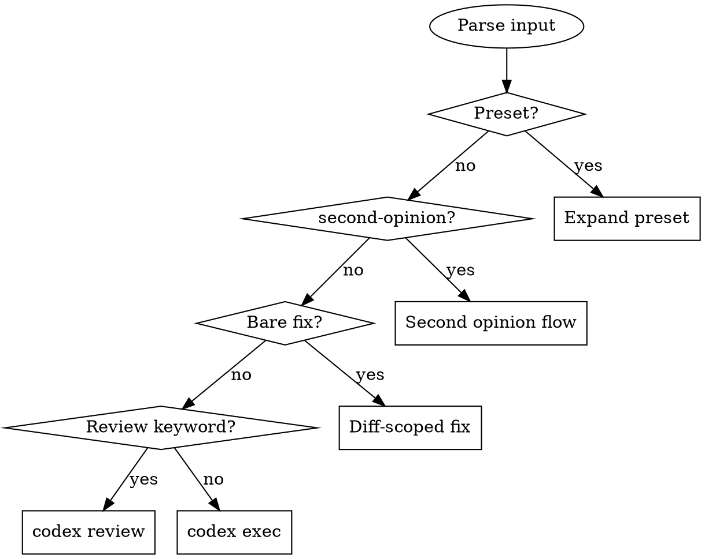

# /codex — Codex CLI Integration

Delegate tasks to OpenAI Codex CLI from within Claude Code.

## Quick Reference

| User says | Resolves to |
|-----------|-------------|
| `/codex review` | `codex review --uncommitted` |
| `/codex review --base main` | `codex review --base main` |
| `/codex review with o3 effort: high` | `codex review --uncommitted -m o3 -c model_reasoning_effort="high"` |
| `/codex security` | `codex review --uncommitted -c model_reasoning_effort="high" "Focus on security: injection, auth bypass, data exposure, OWASP Top 10"` |
| `/codex perf --base main` | `codex review --base main -c model_reasoning_effort="high" "Focus on performance: N+1 queries, unnecessary allocations, missing indexes, expensive loops"` |
| `/codex quick explain this error` | `codex exec --full-auto -c model_reasoning_effort="low" "explain this error"` |
| `/codex thorough refactor auth` | `codex exec --full-auto -c model_reasoning_effort="xhigh" "refactor auth"` |
| `/codex fix` | Capture `git diff` + `git diff --cached` → `codex exec --full-auto "Review and fix issues in this diff: ..."` |
| `/codex fix the broken test` | `codex exec --full-auto "fix the broken test"` |
| `/codex second-opinion` | Rerun last user prompt through Codex, present both answers |
| `/codex <anything else>` | `codex exec --full-auto "<prompt>"` |

## Routing



**Review keywords:** review, code review, check changes, audit, inspect, critique
**Default:** Everything else routes to `codex exec --full-auto`

After routing, for all commands: extract model/effort flags → inject project context (review + presets only) → execute via Bash → summarize results.

## Presets

Detect as first token after `/codex`. Additional text appends to the prompt. User can override model/effort.

| Preset | Mode | Effort | Focus prompt |
|--------|------|--------|-------------|
| `security` | review | high | Security: injection, auth bypass, data exposure, OWASP Top 10 |
| `perf` | review | high | Performance: N+1 queries, unnecessary allocations, missing indexes, expensive loops |
| `quick` | exec | low | _(user's remaining prompt)_ |
| `thorough` | exec | xhigh | _(user's remaining prompt)_ |

## Second Opinion

**Trigger:** `/codex second-opinion` or `/codex second opinion`

1. Find the user's last substantive prompt in conversation (skip meta-commands)
2. Run: `codex exec --full-auto "<original prompt>"`
3. Present: Claude's answer (summary) → Codex's answer → Key differences (bullets)

Append custom focus: `/codex second-opinion focus on error handling`

## Diff-Scoped Fix

**Trigger:** `/codex fix` with NO additional prompt text

1. Capture `git diff` + `git diff --cached` — if empty, stop with "No uncommitted changes"
2. Run: `codex exec --full-auto "Review the following diff and fix any bugs, logic errors, or code quality issues:\n\n<diff>"`
3. Summarize what Codex changed

`/codex fix <something>` (with a prompt) routes to normal exec mode instead.

## Model & Reasoning Effort

Extract model/effort from user input before building the command. Strip from the prompt.

| Input pattern | Flag produced |
|---------------|---------------|
| `-m o3` / `--model o3` / `with o3` / `using o3` | `-m o3` |
| `--effort high` / `--thinking high` / `effort: high` | `-c model_reasoning_effort="high"` |

**Valid levels:** `low`, `medium`, `high`, `xhigh`
**Default:** Inherit from `~/.codex/config.toml`

## Project Context Injection

**Applies to:** review commands and preset commands only (not plain exec).

Read `CLAUDE.md` from project root. Extract key conventions (~200 words max) and prepend:

```
Project conventions: <framework>, <DB>, <patterns>.
<extracted rules>
---
<original prompt>
```

Focus on rules Codex would otherwise violate: architecture layers, DB conventions, code style.

## Rules

- Quote all prompt arguments (double quotes only)
- `--uncommitted` and `--base` are mutually exclusive — default to `--uncommitted`
- Pass through all explicit CLI flags (`-m`, `--base`, `-c`, etc.) verbatim
- Only inject project context for review + presets, not generic exec
- Second opinion requires a prior substantive prompt in conversation
