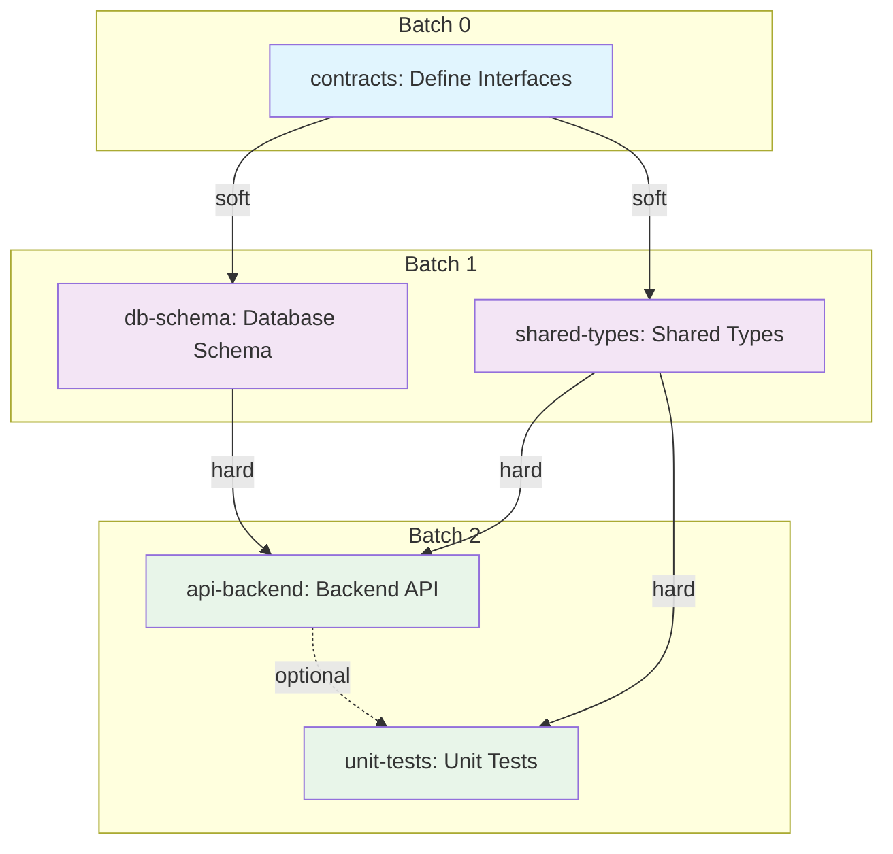

# Parallel Execution v2

Automated subagent orchestration for parallel task execution. Give it an action plan, it analyzes dependencies, batches tasks, and dispatches subagents via the Task tool — with built-in progress tracking via TaskCreate/TaskUpdate/TaskList.

**Constraint:** Maximum **10 parallel subagents** at any time (configurable). Tasks are dynamically scheduled as dependencies resolve.

```
Example: 7 tasks with 3 dependency types
├── Batch 0 (setup): shared-interfaces (soft dep contracts)
├── Batch 1 (parallel): db-schema, api-contracts, shared-types
├── Batch 2 (parallel): api-backend, unit-tests (hard dep on Batch 1)
└── Batch 3 (parallel): e2e-tests, docs (hard dep on Batch 2)
         ↑ dynamic re-batching: if api-backend finishes early,
           e2e-tests can start before unit-tests completes
```

## User Interaction Flow

```
┌─────────────────────────────────────────────────────────────────┐
│ 1. YOU: Provide action plan file (or task-spec.json)            │
│    "Execute this plan in parallel"                              │
└──────────────────────────┬──────────────────────────────────────┘
                           ▼
┌─────────────────────────────────────────────────────────────────┐
│ 2. SKILL: Validates inputs (Step 0)                             │
│    • Git repo check                                             │
│    • Plan file exists                                           │
│    • No conflicting parallel-execution tasks (TaskList check)   │
└──────────────────────────┬──────────────────────────────────────┘
                           ▼
┌─────────────────────────────────────────────────────────────────┐
│ 3. SKILL: Dispatches Plan subagent (Step 1)                     │
│    • Dependency analysis (hard / soft / optional)               │
│    • Task list with IDs, complexity, file ownership             │
│    • Circular dependency detection                              │
└──────────────────────────┬──────────────────────────────────────┘
                           ▼
┌─────────────────────────────────────────────────────────────────┐
│ 4. SKILL: Dispatches Architect subagent (Step 2)                │
│    • Batch scheduling with workload balance                     │
│    • Subagent type assignment per task                          │
│    • File conflict avoidance                                    │
└──────────────────────────┬──────────────────────────────────────┘
                           ▼
┌─────────────────────────────────────────────────────────────────┐
│ 5. YOU: Review & approve (Step 3)                               │
│    • Mermaid dependency graph                                   │
│    • Batch schedule table                                       │
│    • Scope isolation matrix                                     │
│    [Approve] [Revise] [Cancel]                                  │
└──────────────────────────┬──────────────────────────────────────┘
                           ▼
┌─────────────────────────────────────────────────────────────────┐
│ 6. SKILL: Creates task entries (Step 4)                         │
│    • TaskCreate per task with full subagent prompt               │
│    • Sets blockedBy/blocks for hard dependencies                │
└──────────────────────────┬──────────────────────────────────────┘
                           ▼
┌─────────────────────────────────────────────────────────────────┐
│ 7. SKILL: Executes batches (Step 5)                             │
│    • Announces subagents per CLAUDE.md protocol                 │
│    • Confirms via AskUserQuestion                               │
│    • Dispatches up to 10 subagents in parallel via Task tool    │
│    • Reports results after each batch                           │
│    • Runs verification (build/test) if AutoVerify: true         │
│    • TaskUpdate marks tasks completed                           │
└──────────────────────────┬──────────────────────────────────────┘
                           ▼
┌─────────────────────────────────────────────────────────────────┐
│ 8. SKILL: Dynamic re-batching (Step 6)                          │
│    • After each task completes, checks for newly unblocked tasks │
│    • Starts early if running count < MaxParallelSessions        │
└──────────────────────────┬──────────────────────────────────────┘
                           ▼
┌─────────────────────────────────────────────────────────────────┐
│ 9. SKILL: Completion report (Step 7)                            │
│    • Summary table (task, status, subagent, files changed)      │
│    • Verification results                                       │
│    • Next steps (code review, commit)                           │
└─────────────────────────────────────────────────────────────────┘
```

## Prerequisites

- Project must be a git repository
- Action plan file (markdown) or `task-spec.json` from feature-dev Phase 1
- No other parallel-execution session running (checked via TaskList)

## Configuration

Customize in project's `CLAUDE.md`:

```markdown
## Parallel Execution Config
MaxParallelSessions: 10      # Max concurrent subagents (default: 10)
MaxRetries: 2                # Max retries per failed task (default: 2)
DynamicRebatching: true      # Start tasks early when unblocked (default: true)
AutoVerify: true             # Run build/test after each batch (default: true)
ScopeEnforcement: strict     # strict = warn on file violations | relaxed = no checks
```

## When NOT to Use

- Plan has fewer than 3 tasks (overhead not worth it)
- Tasks are tightly coupled (same files across tasks)
- Circular dependencies exist
- Single task with no parallelization opportunity

## Usage

```
/parallel-execution path/to/action-plan.md
```

Or naturally:
```
Execute this plan in parallel using subagents
```

## Dependency Types

| Type | Symbol | Meaning | Scheduling |
|------|--------|---------|------------|
| **Hard** | `→` | Task B cannot start until Task A fully completes | Sequential batches, enforced via `addBlockedBy` |
| **Soft** | `⇢` | Task B needs Task A's interface defined, not full implementation | Batch 0 defines contracts, then both can parallelize |
| **Optional** | `⇝` | Task B benefits from Task A but can proceed independently | Same or any batch, no blocking |

## Workflow Steps

### Step 0: Input & Validation

1. Accept plan file path (argument or ask user)
2. Read and validate plan content
3. Verify git repository
4. Check TaskList for conflicting `[parallel-exec]` tasks — block if found
5. If plan is `task-spec.json`, extract task definitions

### Step 1: Dependency Analysis — Dispatch Plan Agent

**Use Task tool with `subagent_type: Plan`**

```
Prompt for Plan agent:

Analyze the following action plan and produce a dependency analysis:

1. **Task Identification**
   - List all distinct tasks/steps with unique IDs
   - Categorize each: database | backend-api | backend-models | frontend-ui | frontend-state | unit-tests | e2e-tests | documentation
   - Estimate complexity: S (< 30 min) | M (30-90 min) | L (> 90 min)

2. **Dependency Graph (3 types)**
   - **Hard dependencies** (→): Task B cannot start until Task A fully completes
   - **Soft dependencies** (⇢): Task B needs Task A's interface/contract, not full implementation
   - **Optional dependencies** (⇝): Task B benefits from Task A but can proceed without it
   - Detect circular dependencies — report them as BLOCKING errors

3. **File Ownership Map**
   - For each task, list files it will create or modify
   - Flag conflicts: files claimed by multiple tasks
   - Suggest resolution for conflicts (merge tasks or serialize)

4. **Interface Contracts**
   - Identify shared interfaces, types, contracts between tasks
   - If soft dependencies exist, define the contracts needed for Batch 0

**REQUIRED Output Format:**

Tasks:
- {task-id}: {name} | Category: {category} | Complexity: {S|M|L}
  Files: {file-list}
  Hard deps: {task-ids or "none"}
  Soft deps: {task-ids or "none"}
  Optional deps: {task-ids or "none"}

Circular Dependencies: {none | list}
File Conflicts: {none | list with resolution}
Interface Contracts: {list or "none needed"}

Plan content:
{plan_content}
```

### Step 2: Task Design & Batching — Dispatch Architect Agent

**Use Task tool with `subagent_type: backend-architect`**

```
Prompt for Architect agent:

Based on this dependency analysis, design a batched execution schedule:

1. **Batch 0** (if soft dependencies exist)
   - Single task to define shared interfaces/contracts
   - Unblocks parallel implementation in Batch 1+

2. **Batches 1-N**
   - Schedule tasks by: dependency resolution order, workload balance, file conflict avoidance
   - Max 10 tasks per batch (configurable)
   - Tasks in same batch should have similar complexity
   - Avoid placing tasks with file conflicts in same batch

3. **Subagent Type Assignment**
   Use this mapping (user can override):
   | Task Category | Subagent Type |
   |--------------|---------------|
   | Database (tables, SPs) | backend-developer |
   | Backend API (controllers, services) | backend-developer |
   | Backend models/DTOs/interfaces | csharp-developer |
   | Frontend UI (pages, components) | vue-expert |
   | Frontend state/composables | vue-expert |
   | Unit tests (.NET) | csharp-developer |
   | E2E tests (Playwright) | test-automator |
   | Documentation | general-purpose |

4. **Scope Isolation Matrix**
   For each task, define:
   - **OWN**: Files this task creates/modifies exclusively
   - **DO NOT TOUCH**: Files owned by other tasks
   - **READ ONLY**: Shared files for reference (e.g., interfaces, configs)

**REQUIRED Output Format:**

Batch Schedule:
- Batch 0: {task-id} (interface contracts) [if needed]
- Batch 1 (parallel): {task-id-1} [{subagent-type}], {task-id-2} [{subagent-type}], ...
- Batch 2 (parallel, after Batch 1): ...
- Batch N: ...

Scope Isolation:
- {task-id}:
  OWN: {files}
  DO NOT TOUCH: {files}
  READ ONLY: {files}

Dependency analysis:
{analysis_from_step_1}
```

### Step 3: Approval Presentation

Present to user with three artifacts:

**1. Mermaid Dependency Graph**

````markdown

````

**2. Batch Schedule Table**

```
| Task ID | Name | Batch | Complexity | Subagent Type |
|---------|------|-------|------------|---------------|
| contracts | Define Interfaces | 0 | S | csharp-developer |
| db-schema | Database Schema | 1 | M | backend-developer |
| shared-types | Shared Types | 1 | S | csharp-developer |
| api-backend | Backend API | 2 | L | backend-developer |
| unit-tests | Unit Tests | 2 | M | csharp-developer |
```

**3. Scope Isolation Matrix**

```
| Task ID | OWN (creates/modifies) | DO NOT TOUCH | READ ONLY |
|---------|----------------------|--------------|-----------|
| db-schema | Database/*.sql | Api/*, Web/* | shared-types output |
| api-backend | Api/Controllers/*, Api/Services/* | Database/*, Web/* | shared-types, db-schema |
```

**User Gate:** `[Approve] / [Revise] / [Cancel]` via AskUserQuestion

- **Approve**: Proceed to Step 4
- **Revise**: User provides feedback, re-run Step 2 with adjustments
- **Cancel**: Abort, clean up any state

### Step 4: Task Creation via TaskCreate

For each task, create a TaskCreate entry:

```
TaskCreate:
  subject: "[parallel-exec] {task-id}: {task-name}"
  description: |
    Full subagent prompt generated from @templates/task-prompt-template.md
    Includes: scope, files, contracts, verification steps
  activeForm: "Executing {task-name}"
```

Set dependencies using `addBlockedBy` / `addBlocks` for **hard** dependencies only.

Example:
```
Task "api-backend" → addBlockedBy: ["db-schema", "shared-types"]
Task "unit-tests" → addBlockedBy: ["shared-types"]
```

### Step 5: Batch Execution — Subagent Dispatch

For each batch, follow the CLAUDE.md agent orchestration protocol:

1. **ANNOUNCE** which subagents will run:
   ```
   Batch {N} requires the following subagents:
   - {subagent-type} for {task-id}: {purpose}
   - {subagent-type} for {task-id}: {purpose}
   ```

2. **CONFIRM** via AskUserQuestion before dispatching

3. **INVOKE** via Task tool — launch up to 10 subagents in parallel:
   ```
   Task tool calls (parallel):
   - subagent_type: {type}, prompt: {task-prompt from template}
   - subagent_type: {type}, prompt: {task-prompt from template}
   - subagent_type: {type}, prompt: {task-prompt from template}
   ```

4. **COLLECT** results from all subagents in batch

5. **VERIFY** (if `AutoVerify: true`):
   - Run build command (e.g., `dotnet build`)
   - Run relevant test suite
   - Report pass/fail

6. **UPDATE** via TaskUpdate: mark completed tasks, report failures

7. **REPORT** batch results to user:
   ```
   Batch {N} Complete:
   | Task ID | Status | Files Changed | Notes |
   |---------|--------|---------------|-------|
   ```

**Error handling per task:**
- If subagent fails: keep task `in_progress`, offer retry (up to MaxRetries)
- If build fails: identify causing task, offer targeted retry
- If test fails: report failures, ask user: proceed or fix
- Partial batch failure: completed tasks stay completed, failed task only blocks its dependents

### Step 6: Dynamic Re-batching

After **each task** completes (not just after each batch):

1. Check TaskList for tasks where all `blockedBy` are now completed
2. Count currently running subagents
3. If unblocked tasks exist AND running < MaxParallelSessions:
   - Ask user: "Task {id} is now unblocked. Start early? [Yes/No]"
   - If yes, dispatch immediately
4. This is best-effort optimization — does not restructure the batch plan

### Step 7: Completion Report

```
══════════════════════════════════════════════
 PARALLEL EXECUTION COMPLETE
══════════════════════════════════════════════

Summary:
| Task ID | Status | Subagent | Files Changed |
|---------|--------|----------|---------------|
| db-schema | ✅ Completed | backend-developer | 3 files |
| shared-types | ✅ Completed | csharp-developer | 2 files |
| api-backend | ✅ Completed | backend-developer | 5 files |
| unit-tests | ✅ Completed | csharp-developer | 4 files |

Verification:
- Build: ✅ Passing
- Tests: ✅ 47/47 passing

Next Steps:
1. Review all changes (consider /code-review)
2. Commit: git add -A && git commit
3. Run full test suite
```

## Subagent Summary

| Step | Agent | Purpose |
|------|-------|---------|
| 0 | — | Input validation |
| 1 | `Plan` | Dependency analysis (3 dep types, file ownership) |
| 2 | `backend-architect` | Batch scheduling, subagent assignment, scope isolation |
| 3 | — | User approval gate |
| 4 | — | TaskCreate entries with blockedBy |
| 5 | Per-task (see mapping) | Execute tasks (max 10 parallel) |
| 6 | — | Dynamic re-batching check |
| 7 | — | Completion report |

**Total agents dispatched:** 2 (analysis) + N (execution, max 10 at a time)

## Subagent Type Mapping

| Task Category | Subagent Type |
|--------------|---------------|
| Database (tables, SPs) | `backend-developer` |
| Backend API (controllers, services) | `backend-developer` |
| Backend models/DTOs/interfaces | `csharp-developer` |
| Frontend UI (pages, components) | `vue-expert` |
| Frontend state/composables | `vue-expert` |
| Unit tests (.NET) | `csharp-developer` |
| E2E tests (Playwright) | `test-automator` |
| Documentation | `general-purpose` |

User can override any assignment during Step 3 approval.

## Task Prompt Template

See @templates/task-prompt-template.md

## Additional Resources

| Resource | Content |
|----------|---------|
| **EXAMPLES.md** | Complete examples with Mermaid graphs, batch execution, and completion reports |
| **TROUBLESHOOTING.md** | Subagent failure handling, retry logic, recovery procedures |

## Integration

- **feature-dev**: Accepts `task-spec.json` from Phase 1 as input
- **session-orchestrator**: Use /session-end after completion for handoff
- **TaskCreate/TaskUpdate/TaskList**: Built-in progress tracking
